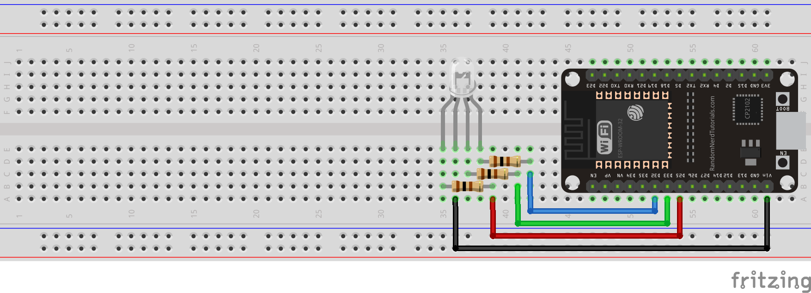
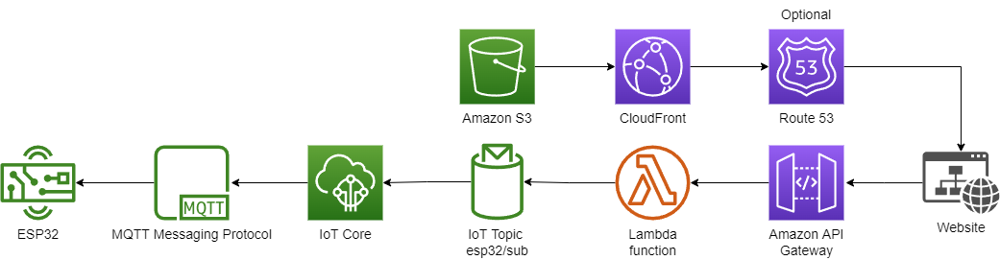
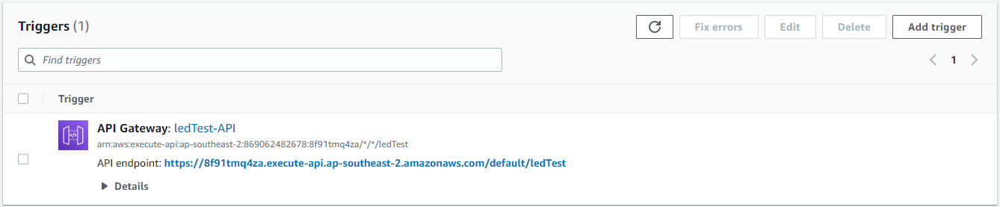
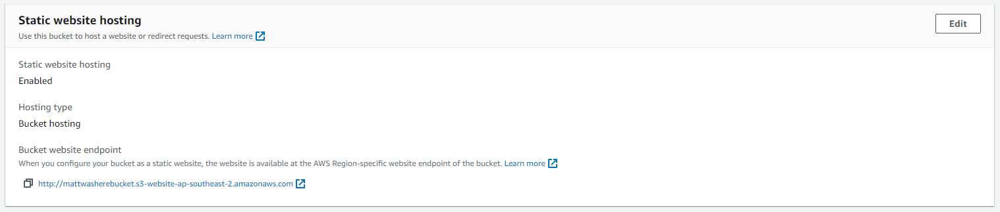
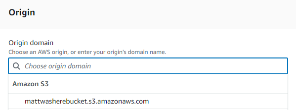
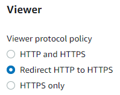

# Basic IoT Project - Control RGB LED from Webpage

Based on the example: https://aws.amazon.com/blogs/compute/building-an-aws-iot-core-device-using-aws-serverless-and-an-esp32/

**NOTE: This isn't a comprehensive guide, just an overview. The steps and definitions need a bit of work**

## Requirements

- Arduino
- Breadboard
- 4x Male-Male Dupont Wires
- RGB LED
- 3x 200Ω Resistors
- Access to AWS (only need access to the free tier)

## Setting up the Arduino

**NOTE: I reccommend using platformIO through VS code as it compiles faster than the Arduino IDE**

Add the files main.ino + secrets.h to the workspace/sketch

Make sure you have the correct board set in your config/ relevant board manager loaded, in my case the config is set for a DOIT ESP32 DEVKIT V1

Add the additional required libraries including:

- [arduino-MQTT](https://github.com/256dpi/arduino-mqtt) (by Joel Gaehwiler) search: mqtt in library manager\*
- ArduinoJson (by Benoit Blanchon) search: json in library manager

(\*unable to find this using arduino's built in library manager, platform io had no issue)

## Building the circuit

Connect a resistor to each of the non common anode legs, then run wires from the ESP to the resistors: D32-RED Resistor, D33-GREEN Resistor and D25-BLUE Resistor. If you have a common anode LED connect the common anode of the LED to VIN\*\*.

\*\*NOTE: If you have an common cathode LED, connect the common pin to GND and modify the .ino file lines containing `analogWrite(<COLOUR>_PIN, 255 - <colour>);` to `analogWrite(<COLOUR>_PIN, <colour>);`

## AWS Setup

### IoT Core

IoT Core enables the ESP32 to easily send and recieve data in the form of MQTT messages

**Setup**

- Create a thing
- Create a single thing
- Set the thing name and add it to secrets.h, leave everything else as default
- Auto generate new certificates, download and add certificates to secrets.h
- Add a pulicy with the actions of iot:Connect, iot:Subscribe, iot:Recieve and iot:Publish

### Lambda

Lambda allows you to run code on the cloud. The code can be set to run aka triggered by an endpoint (i.e. by HTTP request or even S3 upload among many other things).

**Setup**

- Create a function
- Author from Scratch
- Choose Python 3.9 as the runtime, all else default
- Add the code from lambda_ledTest.py to the code source
- Add API gateway as a trigger
  - create a new api, leave defaults
- copy the provided API endpoint and add it to led.js

### S3

S3(Simple Storage Service) offers file storing and serving and even basic website hosting.

**Setup**

Create a new bucket

Upload the files led.html, led.js and led.css to the bucket

Enable Static Website hosting on S3

### Cloudfront

Cloudfront is a content delivery network(CDN), in this case it provides security and performance. Cloudfront serves content from one of many locations with cached copies, S3 serves content from one central location resulting in slower load time in most cases. Cloudfront also simplifies the Policy configuration, providing the bucket policy.

**Setup**

Create a new Distribution

Set the Distribution's Origin Domain to the Bucket website endpoint

Set Viewer Protocol policy to Redirect HTTP to HTTPS (best practice)

If using a custom domain you can modify other settings here to add it

## Extra

If you want to get fancy you can use Route 53 to point a domain to the cloudfront distribution

### Route 53

Route 53 is primarily a DNS web service, this not only enables you to link IP addresses to domains but also add CNAME records which can point one domain to another. You can also add SSL certificates to your site with it.

## Results

https://test.xn--v6da.com/ESP32Test.mp4
